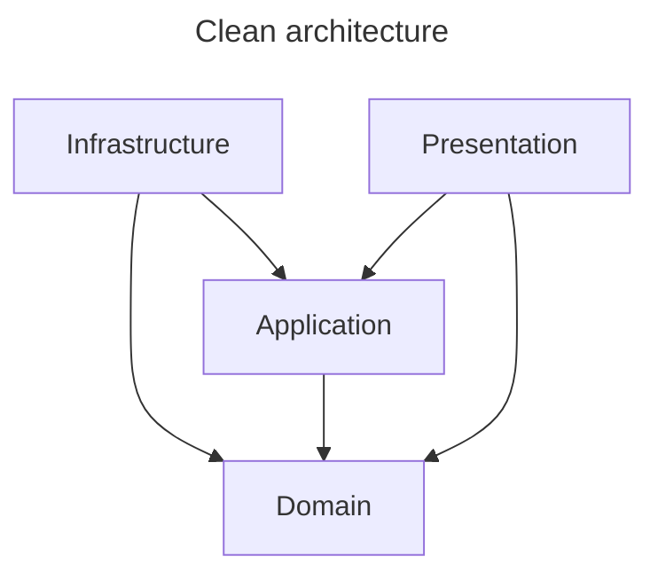

# StructureGuard

StructureGuard is a Roslyn-based architectural guard for C# projects. It allows you to define and enforce dependency rules between different layers or vertical slices of your application using namespaces, rather than relying solely on assembly (DLL) boundaries.

## Why StructureGuard?

- **Guard Vertical Slices**: While layered architecture is often captured via different projects, guarding vertical slices within a single project is challenging. StructureGuard uses namespaces as the primary boundary.
- **DLLs are for deployment**: If you do not intend to deploy components independently, splitting your application into numerous projects/DLLs can lead to unnecessary complexity and slower build times.
- **Namespaces as first-class citizens**: Namespaces are more flexible and descriptive than assembly boundaries for defining internal structure.
- **Shift-Left Feedback**: Unlike unit tests (like NetArchTest) that run after compilation, StructureGuard provides real-time feedback directly in your IDE and fails the build during compilation if a rule is violated.

## How it works

Create a "Analyzer" project in your solution in which you define your architectural rules. This project must reference `StructureGuard` and implements a class inheriting from `SliceAnalyzer`. For the analyser to work in your code, your project must reference this Analyzer project.

### 1. Create your Analyzer Project

Create a new `netstandard2.0` class library project (e.g., `MyProject.Analyzer`).

Add a reference to the `StructureGuard` library. (use Nuget once a version is available there)

### 2. Configure your Rules

#### 1. Using mermaid


#### 2. Using C# code
Create a class that inherits from `SliceAnalyzer` and override `OnInitialize` to define your root namespace and permitted dependencies.

```csharp
using System.Collections.Generic;
using Microsoft.CodeAnalysis;
using Microsoft.CodeAnalysis.Diagnostics;
using StructureGuard;

namespace MyProject.Analyzer
{
    [DiagnosticAnalyzer(LanguageNames.CSharp)]
    public class MyStructureGuard : SliceAnalyzer
    {
        protected override void OnInitialize(AnalysisContext context)
        {
            // The base namespace of your application
            RootNameSpace = "MyProject.App";

            // Define allowed dependencies between namespaces
            // Format: new Dependency(fromLayer, toLayer)
            PermittedDependencies = new List<Dependency>()
            {
                // Infrastructure can depend on Domain
                new Dependency(new Layer("Infrastructure"), new Layer("Domain")),
                
                // Web can depend on both Infrastructure and Domain
                new Dependency(new Layer("Web"), new Layer("Infrastructure")),
                new Dependency(new Layer("Web"), new Layer("Domain")),
            };

            base.OnInitialize(context);
        }
    }
}
```

### 3. Apply to your Target Project

In your main application project (`.csproj`), add a reference to your Analyzer project using `OutputItemType="Analyzer"` and `ReferenceOutputAssembly="false"`.

```xml
<ItemGroup>
  <ProjectReference Include="..\MyProject.Analyzer\MyProject.Analyzer.csproj" 
                    OutputItemType="Analyzer" 
                    ReferenceOutputAssembly="false" />
</ItemGroup>
```

## Rule Enforcement

Once configured, the analyzer will monitor your code. If you try to use a type from a namespace that isn't explicitly permitted for your current namespace, you will see a compiler error (STR001) in your IDE.

For example, if `Domain` tries to reference `Infrastructure` but no such dependency is defined in `PermittedDependencies`, a violation is reported.

## Layer Matching

StructureGuard matches layers based on the namespace structure under your `RootNameSpace`.

If `RootNameSpace` is `MyProject.App`:
- A class in `MyProject.App.Domain.Models` is considered part of the `Domain` layer.
- A class in `MyProject.App.Infrastructure.Data` is considered part of the `Infrastructure` layer.