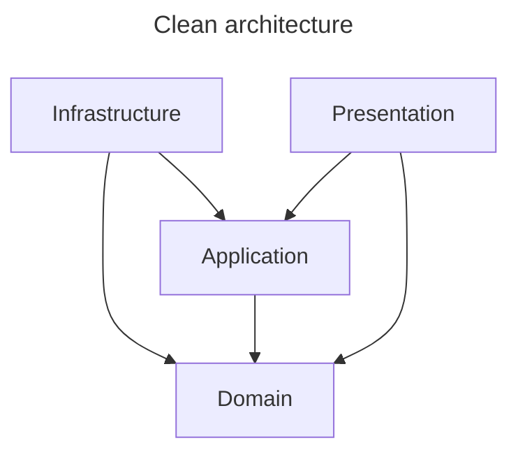

# Clean architecture

This project follows Clean Architecture principles, ensuring that business logic remains isolated from external concerns like databases, APIs, and UI frameworks.

## Layer Responsibilities

#### Domain Layer
The core of the application. It contains the enterprise-wide business logic and entities.
It must have **zero dependencies** on any other layer. It should not know about persistence, networking, or UI.

#### Application Layer
Contains the application-specific business logic.
Typically contains use cases, command/query handlers and interface definitions (e.g., repository interfaces).

#### Infrastructure Layer
Handles the technical details and implementation of interfaces defined in the Application layer.
Typically contains database persistence (EF Core, Dapper), External API clients, File system access, and Logging implementations.
Depends on Application and Domain layers. It "plugs into" the application by implementing its interfaces.

#### Presentation Layer
The entry point to the application, responsible for interacting with the user or external systems.
- **Responsibilities**: Controllers (Web API), Views (Blazor, Razor), CLI commands, and ViewModels/DTOs.
- **Isolation**: Depends on the Application layer to execute business use cases. It should not contain business logic.

## Dependency rules between layers

